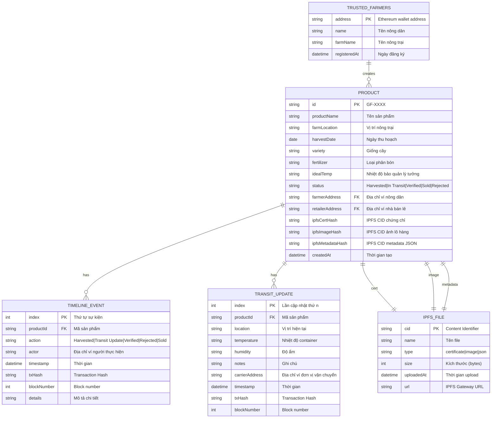
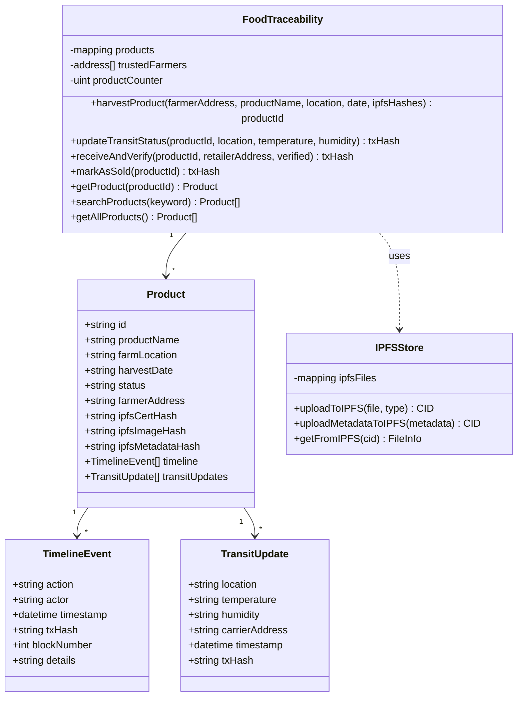

# Entity Relationship Diagram - GreenFarm Food Traceability

## ERD - Mô hình dữ liệu hệ thống

```mermaid
erDiagram
    TRUSTED_FARMERS {
        string address PK "Ethereum wallet address"
        string name "Tên nông dân"
        string farmName "Tên nông trại"
        datetime registeredAt "Ngày đăng ký"
    }

    PRODUCT {
        string id PK "GF-XXXX"
        string productName "Tên sản phẩm"
        string farmLocation "Vị trí nông trại"
        date harvestDate "Ngày thu hoạch"
        string variety "Giống cây"
        string fertilizer "Loại phân bón"
        string idealTemp "Nhiệt độ bảo quản lý tưởng"
        string status "Harvested|In Transit|Verified|Sold|Rejected"
        string farmerAddress FK "Địa chỉ ví nông dân"
        string retailerAddress FK "Địa chỉ ví nhà bán lẻ"
        string ipfsCertHash "IPFS CID chứng chỉ"
        string ipfsImageHash "IPFS CID ảnh lô hàng"
        string ipfsMetadataHash "IPFS CID metadata JSON"
        datetime createdAt "Thời gian tạo"
    }

    TIMELINE_EVENT {
        int index PK "Thứ tự sự kiện"
        string productId FK "Mã sản phẩm"
        string action "Harvested|Transit Update|Verified|Rejected|Sold"
        string actor "Địa chỉ ví người thực hiện"
        datetime timestamp "Thời gian"
        string txHash "Transaction Hash"
        int blockNumber "Block number"
        string details "Mô tả chi tiết"
    }

    TRANSIT_UPDATE {
        int index PK "Lần cập nhật thứ n"
        string productId FK "Mã sản phẩm"
        string location "Vị trí hiện tại"
        string temperature "Nhiệt độ container"
        string humidity "Độ ẩm"
        string notes "Ghi chú"
        string carrierAddress "Địa chỉ ví đơn vị vận chuyển"
        datetime timestamp "Thời gian"
        string txHash "Transaction Hash"
        int blockNumber "Block number"
    }

    IPFS_FILE {
        string cid PK "Content Identifier"
        string name "Tên file"
        string type "certificate|image|json"
        int size "Kích thước (bytes)"
        datetime uploadedAt "Thời gian upload"
        string url "IPFS Gateway URL"
    }

    TRUSTED_FARMERS ||--o{ PRODUCT : "creates"
    PRODUCT ||--o{ TIMELINE_EVENT : "has"
    PRODUCT ||--o{ TRANSIT_UPDATE : "has"
    PRODUCT ||--|| IPFS_FILE : "cert"
    PRODUCT ||--|| IPFS_FILE : "image"
    PRODUCT ||--|| IPFS_FILE : "metadata"
```

## Class Diagram - Smart Contract Structure

```mermaid
classDiagram
    class FoodTraceability {
        -mapping products
        -address[] trustedFarmers
        -uint productCounter
        +harvestProduct(farmerAddress, productName, location, date, ipfsHashes) productId
        +updateTransitStatus(productId, location, temperature, humidity) txHash
        +receiveAndVerify(productId, retailerAddress, verified) txHash
        +markAsSold(productId) txHash
        +getProduct(productId) Product
        +searchProducts(keyword) Product[]
        +getAllProducts() Product[]
    }

    class Product {
        +string id
        +string productName
        +string farmLocation
        +string harvestDate
        +string status
        +string farmerAddress
        +string ipfsCertHash
        +string ipfsImageHash
        +string ipfsMetadataHash
        +TimelineEvent[] timeline
        +TransitUpdate[] transitUpdates
    }

    class TimelineEvent {
        +string action
        +string actor
        +datetime timestamp
        +string txHash
        +int blockNumber
        +string details
    }

    class TransitUpdate {
        +string location
        +string temperature
        +string humidity
        +string carrierAddress
        +datetime timestamp
        +string txHash
    }

    class IPFSStore {
        -mapping ipfsFiles
        +uploadToIPFS(file, type) CID
        +uploadMetadataToIPFS(metadata) CID
        +getFromIPFS(cid) FileInfo
    }

    FoodTraceability "1" --> "*" Product
    Product "1" --> "*" TimelineEvent
    Product "1" --> "*" TransitUpdate
    FoodTraceability ..> IPFSStore : uses
```