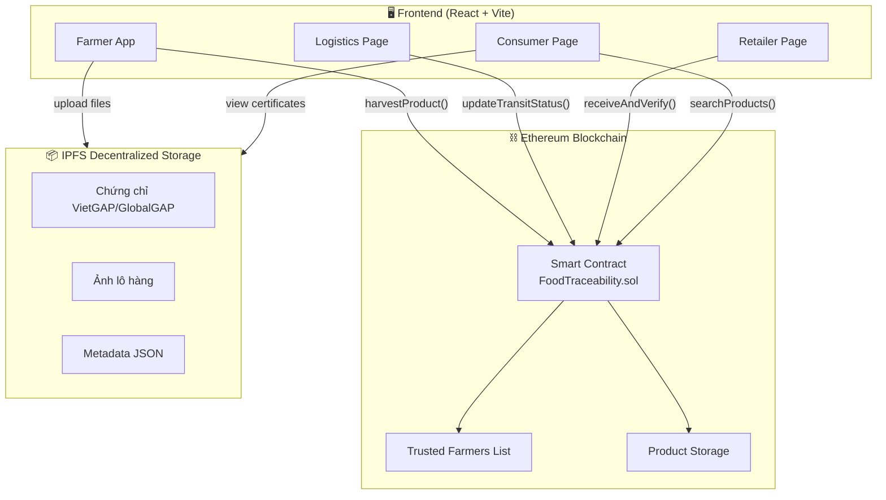
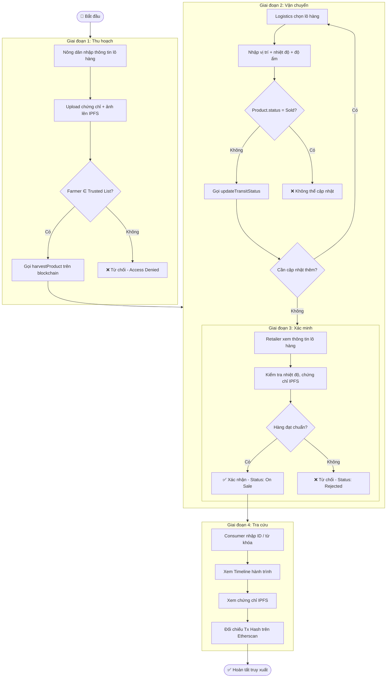
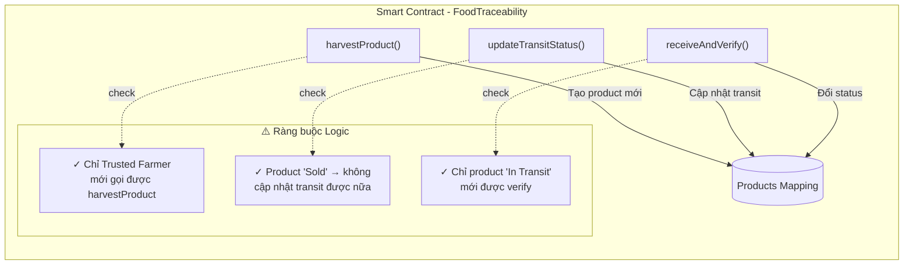
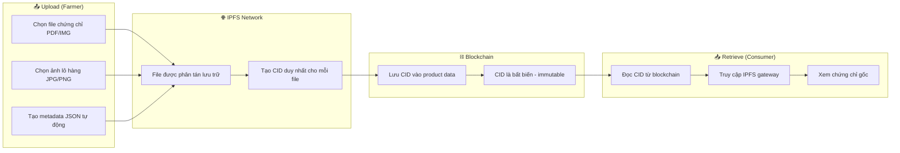
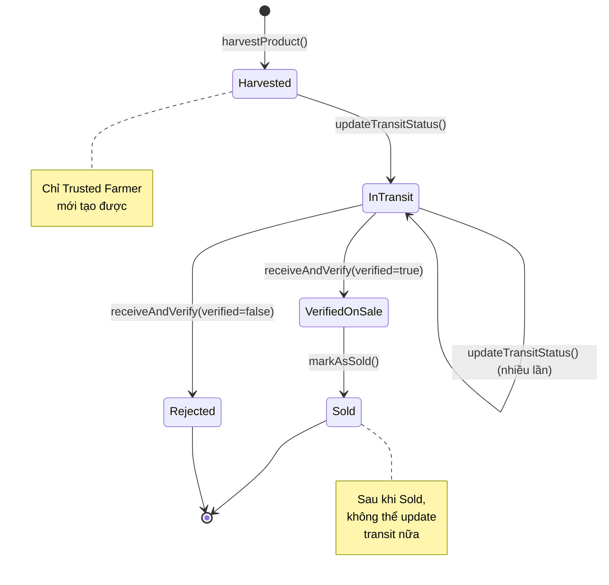

# Flowchart Diagrams - GreenFarm Food Traceability System

## 1. System Architecture (Kiến trúc tổng thể)

## 2. Business Flow (Luồng nghiệp vụ chính)

## 3. Smart Contract Logic Flow

## 4. IPFS Integration Flow

## 5. Product State Machine

