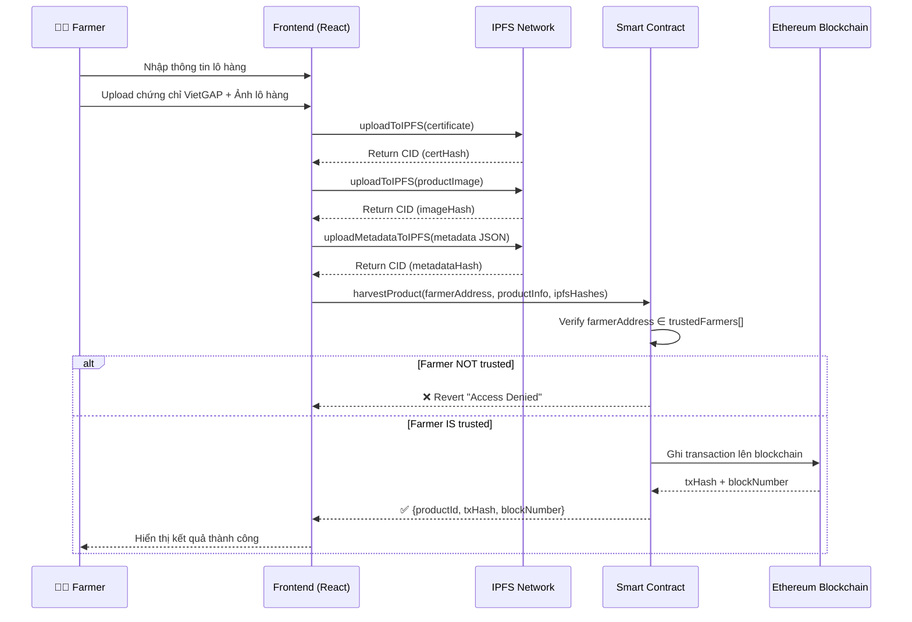
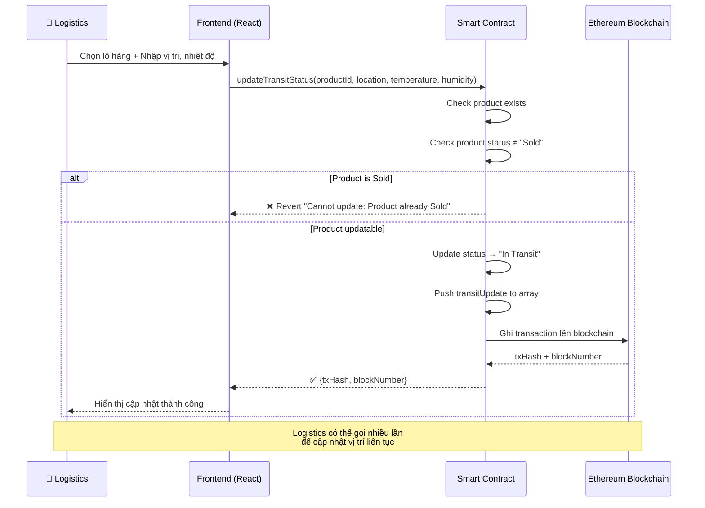
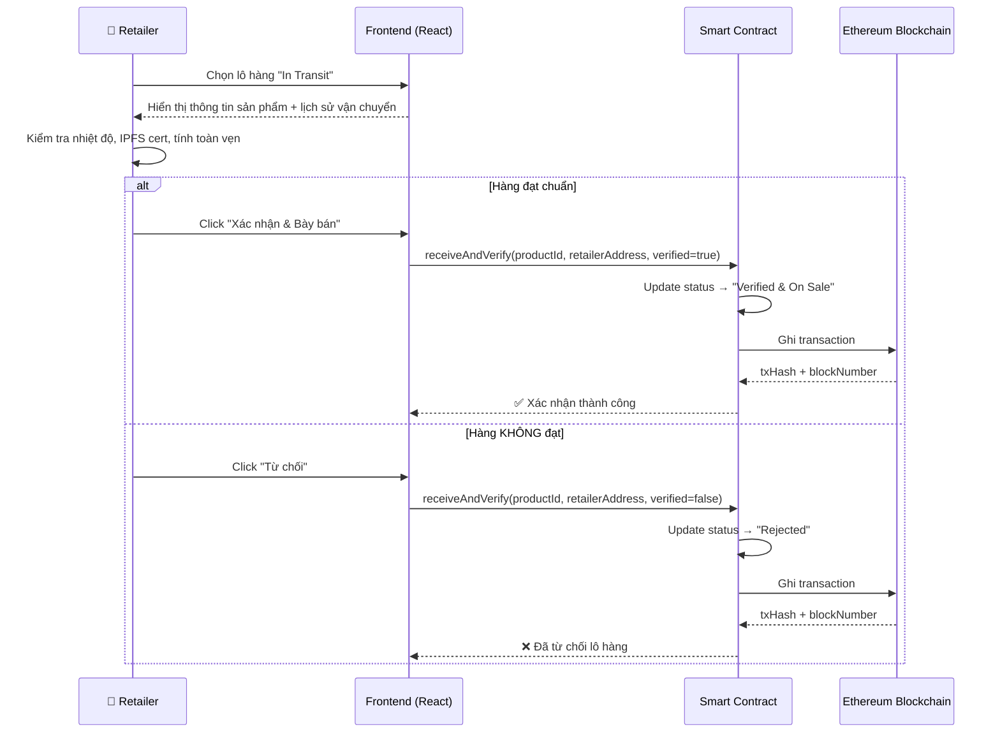
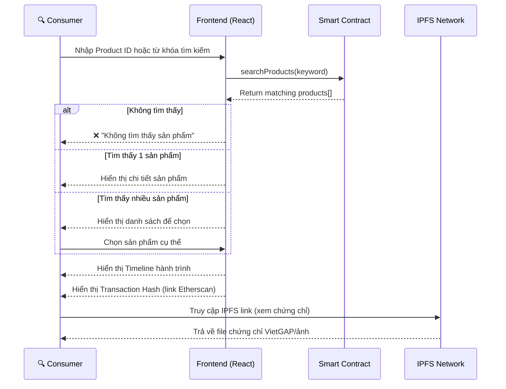

# Sequence Diagrams - GreenFarm Food Traceability System

## 1. Farmer tạo lô hàng (harvestProduct)

## 2. Logistics cập nhật vận chuyển (updateTransitStatus)

## 3. Retailer xác nhận nhận hàng (receiveAndVerify)

## 4. Consumer tra cứu sản phẩm

