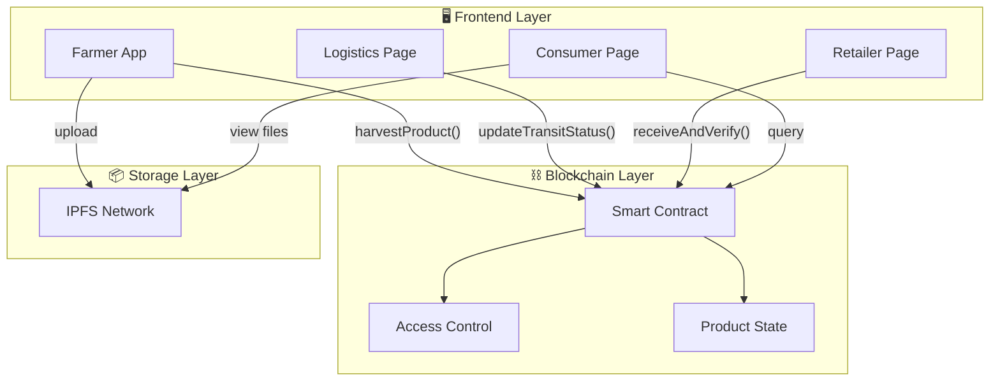
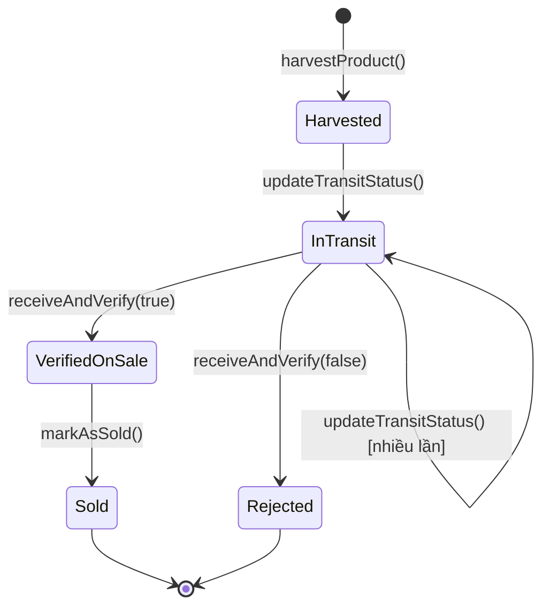

# BÁO CÁO ĐỒ ÁN
# HỆ THỐNG TRUY XUẤT NGUỒN GỐC THỰC PHẨM TRÊN BLOCKCHAIN
## GreenFarm Food Traceability System

---

## MỤC LỤC

1. [Giới thiệu đề tài](#1-giới-thiệu-đề-tài)
2. [Kiến trúc hệ thống](#2-kiến-trúc-hệ-thống)
3. [Smart Contract](#3-smart-contract)
4. [Tích hợp IPFS](#4-tích-hợp-ipfs)
5. [Giao diện Frontend](#5-giao-diện-frontend)
6. [Hướng dẫn cài đặt & chạy](#6-hướng-dẫn-cài-đặt--chạy)
7. [Demo & Kết quả](#7-demo--kết-quả)

---

## 1. Giới thiệu đề tài

### 1.1 Mô tả bài toán
Xây dựng ứng dụng cho phép **theo dõi hành trình** của sản phẩm thực phẩm (Nông sản sạch GreenFarm) đi qua các khâu:

```
🧑‍🌾 Nông trại (Farmer) → 🚚 Vận chuyển (Logistics) → 🏪 Bán lẻ (Retailer) → 🔍 Người tiêu dùng (Consumer)
```

### 1.2 Mục tiêu
- Đảm bảo **minh bạch** trong chuỗi cung ứng thực phẩm
- Sử dụng **Blockchain** để lưu trữ bất biến lịch sử sản phẩm
- Sử dụng **IPFS** để lưu trữ phi tập trung chứng chỉ và hình ảnh
- Cho phép người tiêu dùng **truy xuất toàn bộ hành trình** của sản phẩm

### 1.3 Công nghệ sử dụng

| Thành phần | Công nghệ |
|------------|-----------|
| Frontend | React 18 + Vite 5 |
| Styling | TailwindCSS 3.4 |
| Blockchain | Ethereum (Ethers.js 6) |
| Smart Contract | Solidity (simulated in JS) |
| Lưu trữ phi tập trung | IPFS (Pinata Gateway) |
| Routing | React Router DOM 6 |

---

## 2. Kiến trúc hệ thống

### 2.1 Tổng quan kiến trúc



### 2.2 Cấu trúc thư mục

```
greenfarm/
├── index.html                 # Entry HTML
├── package.json               # Dependencies
├── vite.config.js             # Vite configuration
├── tailwind.config.js         # TailwindCSS config
├── postcss.config.js          # PostCSS config
├── diagrams/                  # System diagrams
│   ├── erd.md                # Entity Relationship Diagram
│   ├── sequence.md           # Sequence Diagrams
│   └── flowchart.md          # Flow Diagrams
├── references/               # UI References
│   └── GreenFarm_UI_Documents.md
└── src/
    ├── main.jsx              # App entry point
    ├── App.jsx               # Root component + routing
    ├── index.css             # Global styles (Tailwind)
    ├── pages/
    │   ├── Farmer.jsx        # Farmer interface
    │   ├── Logistics.jsx     # Logistics interface
    │   ├── Retailer.jsx      # Retailer interface
    │   └── Consumer.jsx      # Consumer lookup page
    └── store/
        ├── blockchainStore.js # Simulated smart contract
        └── ipfsStore.js       # Simulated IPFS storage
```

---

## 3. Smart Contract

### 3.1 Ba nghiệp vụ chính

#### `harvestProduct()` - Nông dân khởi tạo lô hàng

```javascript
// Input: farmerAddress, productName, farmLocation, harvestDate, 
//        variety, fertilizer, idealTemp, ipfsHashes
// Output: { productId, txHash, blockNumber }

// Logic:
// 1. Kiểm tra farmerAddress ∈ trustedFarmers[] → nếu không → revert
// 2. Tạo productId mới (GF-XXXX)
// 3. Lưu product data + IPFS hashes
// 4. Ghi timeline event "Harvested"
// 5. Return transaction info
```

#### `updateTransitStatus()` - Cập nhật vận chuyển

```javascript
// Input: productId, carrierAddress, location, temperature, humidity, notes
// Output: { txHash, blockNumber }

// Logic:
// 1. Kiểm tra product tồn tại
// 2. Kiểm tra product.status ≠ "Sold" → nếu Sold → revert
// 3. Update status → "In Transit"
// 4. Push transit update (location, temp, humidity)
// 5. Ghi timeline event "Transit Update"
```

#### `receiveAndVerify()` - Xác nhận nhận hàng

```javascript
// Input: productId, retailerAddress, verified (boolean), notes
// Output: { txHash, blockNumber }

// Logic:
// 1. Kiểm tra product tồn tại
// 2. Kiểm tra product.status ≠ "Sold"
// 3. Nếu verified = true → status = "Verified & On Sale"
// 4. Nếu verified = false → status = "Rejected"
// 5. Ghi timeline event
```

### 3.2 Hai ràng buộc logic

| Ràng buộc | Mô tả | Implementation |
|-----------|--------|----------------|
| **Kiểm soát quyền** | Chỉ Trusted Farmers mới tạo được sản phẩm | `if (!trustedFarmers.includes(address)) throw Error` |
| **Ràng buộc trạng thái** | Product "Sold" không thể update transit | `if (product.status === 'Sold') throw Error` |

### 3.3 Product State Machine



---

## 4. Tích hợp IPFS

### 4.1 Ba loại dữ liệu lưu trữ trên IPFS

| # | Loại dữ liệu | Format | Mô tả |
|---|--------------|--------|--------|
| 1 | Chứng chỉ VietGAP/GlobalGAP | PDF, JPG, PNG | Ảnh chụp/scan chứng chỉ gốc |
| 2 | Ảnh lô hàng | JPG, PNG | Ảnh thực tế tại thời điểm đóng gói |
| 3 | Metadata JSON | JSON | Giống cây, phân bón, nhiệt độ bảo quản |

### 4.2 Thao tác IPFS

**Upload (khi Farmer đăng ký lô hàng):**
```javascript
// 1. Upload chứng chỉ → nhận CID
const certResult = uploadToIPFS(certFile, "certificate");
// 2. Upload ảnh → nhận CID
const imgResult = uploadToIPFS(productImage, "image");
// 3. Upload metadata JSON → nhận CID
const metaResult = uploadMetadataToIPFS({ variety, fertilizer, idealTemp, ... });
// 4. Lưu 3 CID vào blockchain cùng product data
```

**Retrieve (khi Consumer tra cứu):**
```javascript
// Consumer xem chứng chỉ gốc qua IPFS gateway
<a href={`https://ipfs.io/ipfs/${product.ipfsCertHash}`}>Xem chứng chỉ</a>
<a href={`https://ipfs.io/ipfs/${product.ipfsImageHash}`}>Xem ảnh lô hàng</a>
<a href={`https://ipfs.io/ipfs/${product.ipfsMetadataHash}`}>Xem metadata</a>
```

### 4.3 Tại sao dùng IPFS?

- **Phi tập trung**: Không phụ thuộc 1 server duy nhất
- **Bất biến**: CID = hash của content → không thể sửa file mà giữ CID cũ
- **Tiết kiệm**: Blockchain chỉ lưu CID (46 bytes) thay vì file gốc (MB)
- **Xác minh**: So sánh CID trên chain với file thực tế → đảm bảo toàn vẹn

---

## 5. Giao diện Frontend

### 5.1 Farmer App (/)

**Chức năng:**
- Nhập thông tin: tên sản phẩm, nơi trồng, ngày thu hoạch, giống cây, phân bón, nhiệt độ
- Upload chứng chỉ VietGAP và ảnh lô hàng lên IPFS
- Gọi `harvestProduct()` → nhận Product ID + Tx Hash
- Xem danh sách lô hàng đã tạo

### 5.2 Logistics Page (/logistics)

**Chức năng:**
- Chọn lô hàng cần cập nhật (dropdown lọc theo status)
- Nhập vị trí, nhiệt độ, độ ẩm, ghi chú
- Gọi `updateTransitStatus()` → nhận Tx Hash
- Xem lịch sử vận chuyển của lô hàng
- **Hỗ trợ cập nhật nhiều lần** (mỗi lần ghi 1 transaction mới)

### 5.3 Retailer Page (/retailer)

**Chức năng:**
- Xem danh sách lô hàng "In Transit" đang chờ xác nhận
- Xem chi tiết: thông tin sản phẩm, số lần cập nhật, nhiệt độ cuối, chứng chỉ IPFS
- Xác nhận (✅) hoặc Từ chối (❌) lô hàng
- Gọi `receiveAndVerify()` → cập nhật status
- Xem danh sách sản phẩm đang bày bán

### 5.4 Consumer Page (/consumer)

**Chức năng:**
- Tìm kiếm theo ID, tên sản phẩm, hoặc nơi trồng (case-insensitive, partial match)
- Hiển thị thông tin chi tiết sản phẩm
- Hiển thị chứng chỉ IPFS (cert, ảnh, metadata) với link truy cập
- **Timeline hành trình** đầy đủ với thời gian, hành động, block number
- **Transaction Hash** có link tới Etherscan để đối chiếu

---

## 6. Hướng dẫn cài đặt & chạy

### 6.1 Yêu cầu hệ thống
- Node.js >= 18.x
- npm >= 9.x

### 6.2 Cài đặt

```bash
# Clone project
git clone <repository-url>
cd greenfarm

# Cài đặt dependencies
npm install
```

### 6.3 Chạy development server

```bash
npm run dev
```

Truy cập: **http://localhost:5173**

### 6.4 Build production

```bash
npm run build
npm run preview
```

---

## 7. Demo & Kết quả

### 7.1 Demo Data

Hệ thống tự động seed 1 sản phẩm demo khi khởi động:

| Trường | Giá trị |
|--------|---------|
| Product ID | GF-1001 |
| Tên | Xoài Cát Hòa Lộc |
| Nơi trồng | Tiền Giang, Việt Nam |
| Ngày thu hoạch | 2026-05-10 |
| Giống | Cát Hòa Lộc |
| Phân bón | Phân hữu cơ vi sinh |
| Nhiệt độ | 13°C |
| Status | Verified & On Sale |

**Timeline đã có sẵn:**
1. ✅ Harvested → by 0xFarmer001
2. 🚚 Transit Update → Kho lạnh Bình Dương (14°C)
3. 🚚 Transit Update → Trung tâm phân phối TP.HCM (13°C)
4. ✅ Received & Verified → by 0xRetailer001

### 7.2 Kết quả đạt được

| Tiêu chí | Yêu cầu | Kết quả |
|-----------|----------|---------|
| Smart Contract | 3 nghiệp vụ + 2 ràng buộc | ✅ Đầy đủ |
| Frontend | Farmer App + Consumer Page + Logistics + Retailer | ✅ 4 trang |
| IPFS | 3 loại dữ liệu + Upload/Retrieve | ✅ Đầy đủ |
| Tx Hash | Hiển thị + link Etherscan | ✅ Có |
| Vận chuyển | Update nhiều lần | ✅ Có |
| Tìm kiếm | Partial match, case-insensitive | ✅ Có |

---

## PHỤ LỤC

### A. Danh sách dependencies

```json
{
  "dependencies": {
    "react": "^18.2.0",
    "react-dom": "^18.2.0",
    "react-router-dom": "^6.20.0",
    "ethers": "^6.9.0"
  },
  "devDependencies": {
    "@vitejs/plugin-react": "^4.0.0",
    "autoprefixer": "^10.4.16",
    "postcss": "^8.4.32",
    "tailwindcss": "^3.4.0",
    "vite": "^5.0.0"
  }
}
```

### B. Tham khảo diagrams chi tiết

- [ERD & Class Diagram](../diagrams/erd.md)
- [Sequence Diagrams](../diagrams/sequence.md)
- [Flowchart & Architecture](../diagrams/flowchart.md)
